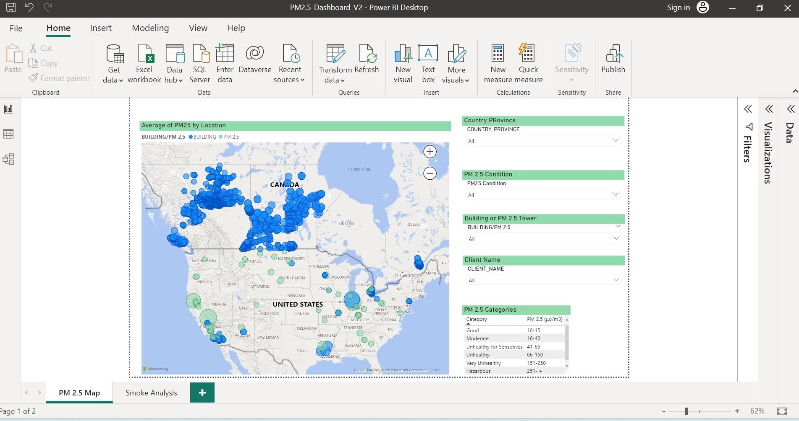
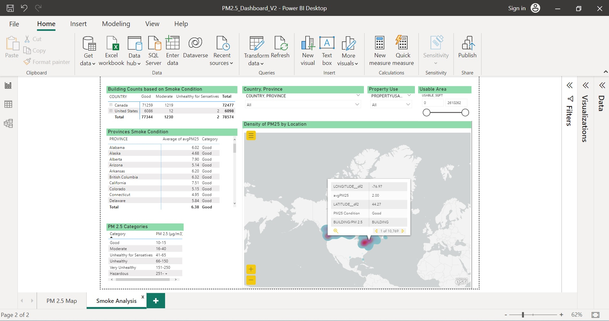

80% of this work is done by me.
The Sustainability team was interested in making a warning system that could predict if the smoke of wildfire is getting closer to their infrastructures and clients' buildings and if so, how fast the smoke improves and find out the best time for evacuation in order to keep the occupants healthy.
As this was the first time such a project was requested, I researched the most important factors in the smoke that affect people's health and then included other variables in the next version. 
Research showed me that PM 2.5 is one of the most common pollutants in smoke. Therefore I use Airnow.gov API to get North America's smoke data every day. This data was captured from various towers and each was distinguished with a unique AQSID.
Afterwards, I cleand the data and took an average for every tower for the day before and called the table "Yesterday".
Then merged it with our Building data on Building_ID. I gave the PM 2.5  towers a Building_ID as well. 
Then found the nearest neighbor tower ( up to 1000 km) to each building and gave the value of PM 2.5 to that building, using the Haversine formula and latitude and longitude.
After some cleaning, binned the amount of P.M 2.5 allocated to each building to categories from healthy, Moderate,... Hazardous based on resources.
Then some alterations were made and the final result was saved in a csv file.
Each CSV file was pulled every day to our dashboard.
I made the dashboard in a way that we could see every day, how many buildings in each state/province are experiencing healthy/unhealthy/dangerous/ air quality or mapped them out on a GIS map and other various categories and investigations.

