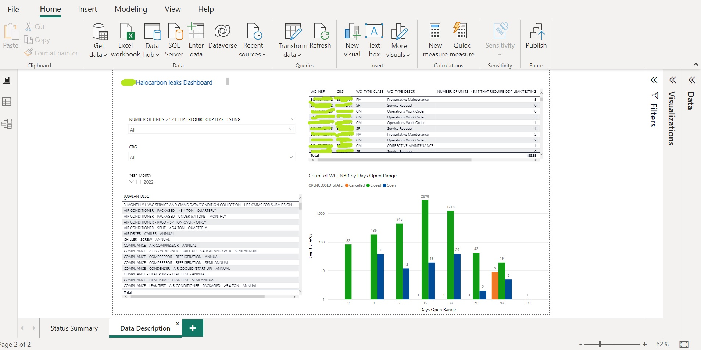

100% of this work is done by me.
The business team was interested in finding the status of work orders related to HVAC units, greater than a certain size, in order of open, closed, cancelled, etc. and if they are open, how many days they were opne and investigate if they are meeting the deadline, they are late or any other situations.
I searched for the best tables with examining varios features, in snoflake, then cleaned these data and found the needed criteria and finally binned the "open days" span and their status.
In the final step, I presented these findings in a dashboard and worked on which clients has major struggles and where are the points for improvements.

#
